# Currency & Legal Tender

This page lists every UBS legal-tender cash item currently in the mod.

## Notes

- Legal tender in UBS is physical USD cash: bills and coins.
- `bank_note` and `cheque` are negotiable instruments, not base legal-tender cash items.
- ATM behavior:
  - withdraw: bills only
  - deposit: bills + coins (exact combination required)
- Bank Teller can dispense bills + coins.

## Bills

| Denomination | Item ID | Texture |
|---|---|---|
| $1 bill | `ultimatebankingsystem:one_dollar_bill` | 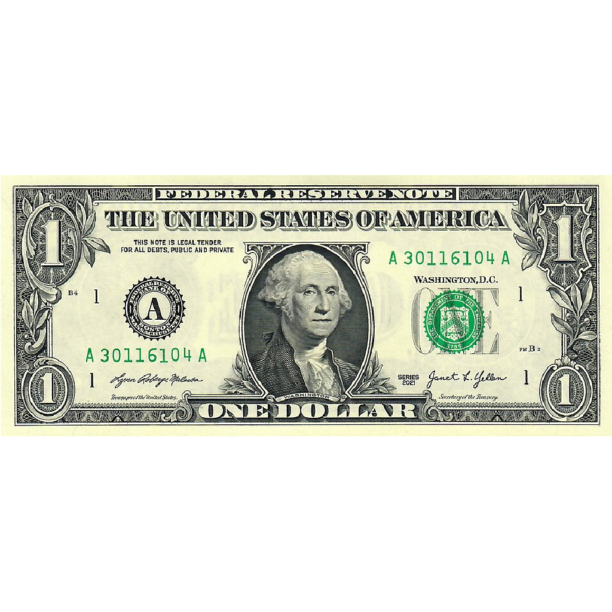 |
| $2 bill | `ultimatebankingsystem:two_dollar_bill` | 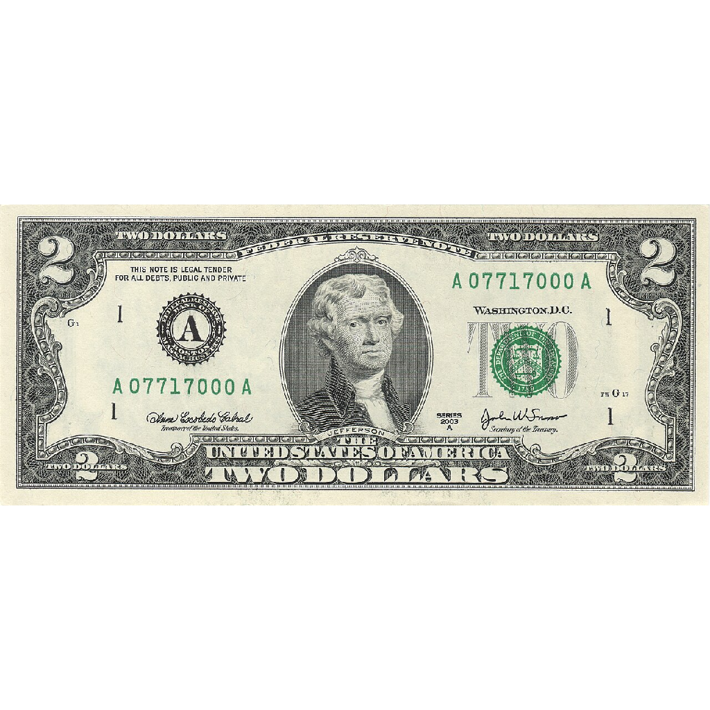 |
| $5 bill | `ultimatebankingsystem:five_dollar_bill` | 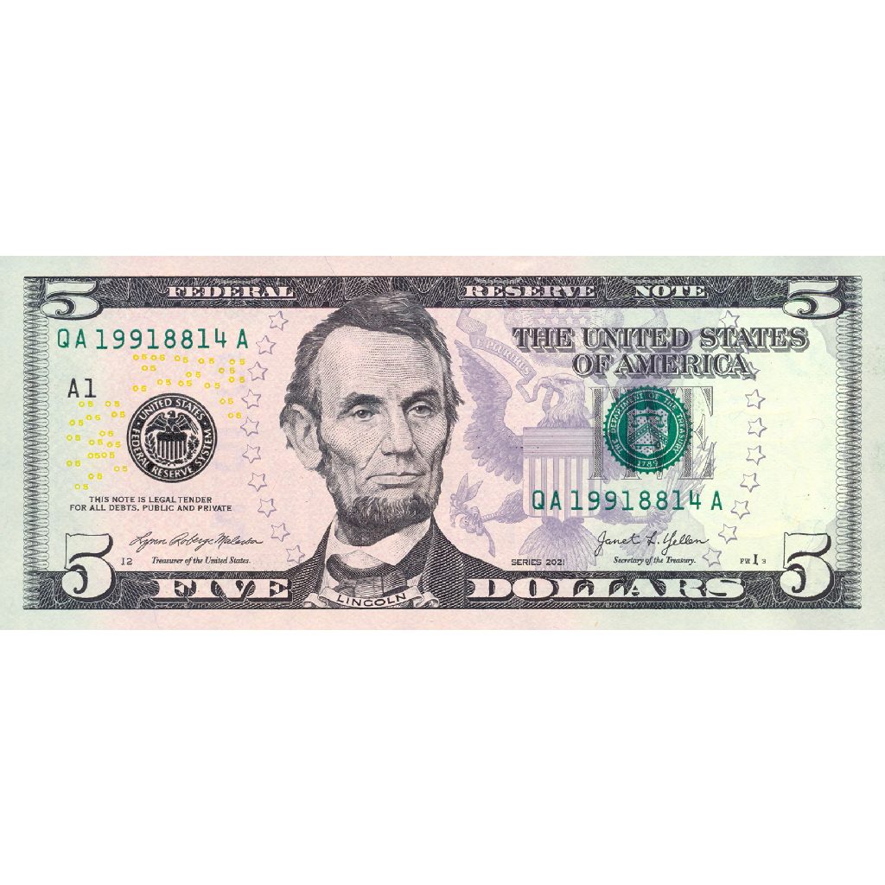 |
| $10 bill | `ultimatebankingsystem:ten_dollar_bill` | 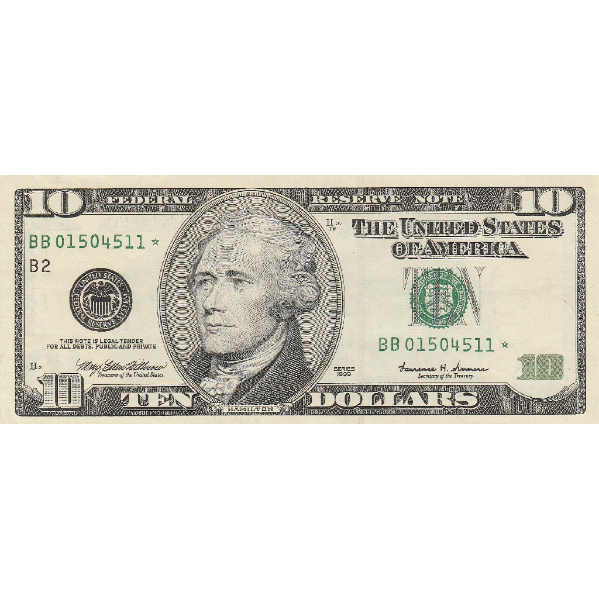 |
| $20 bill | `ultimatebankingsystem:twenty_dollar_bill` | 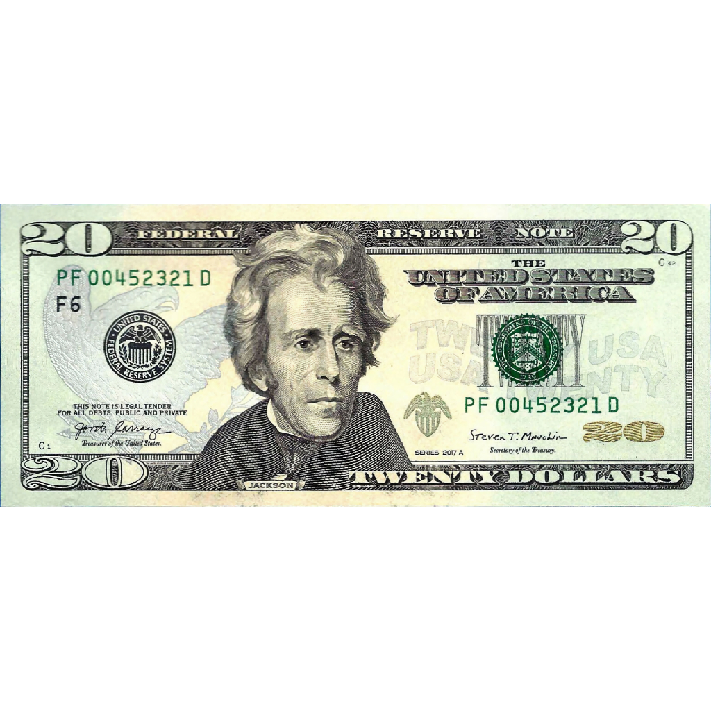 |
| $50 bill | `ultimatebankingsystem:fifty_dollar_bill` | 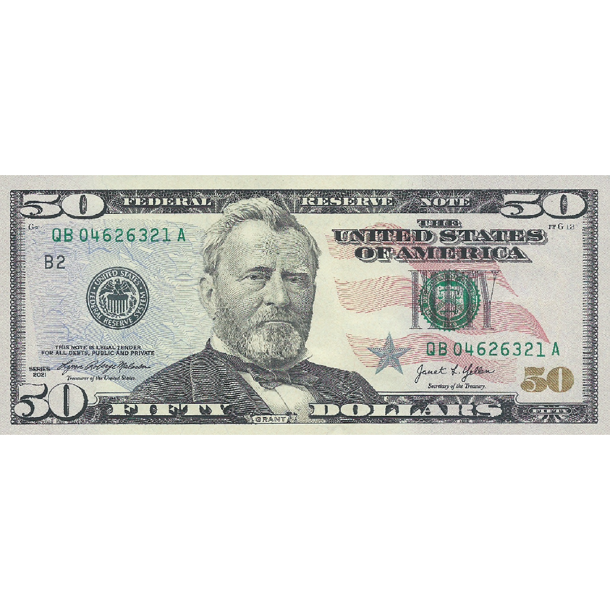 |
| $100 bill | `ultimatebankingsystem:hundred_dollar_bill` | 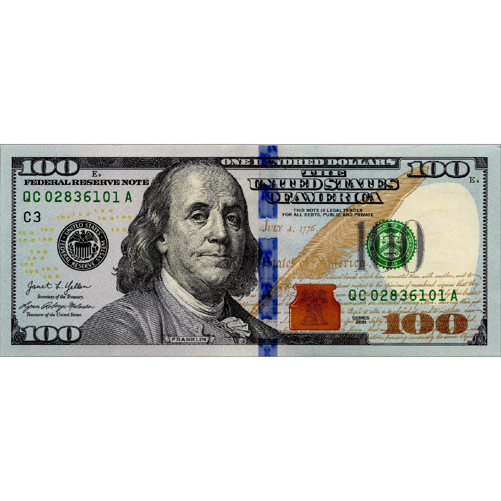 |

## Coins

| Denomination | Item ID | Front | Back |
|---|---|---|---|
| $0.01 (Penny) | `ultimatebankingsystem:penny_coin` | 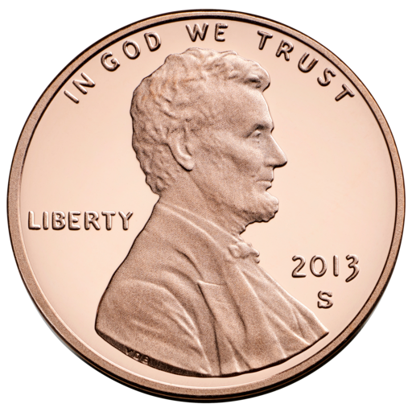 | 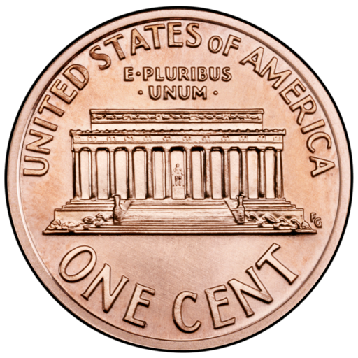 |
| $0.05 (Nickel) | `ultimatebankingsystem:nickel_coin` | 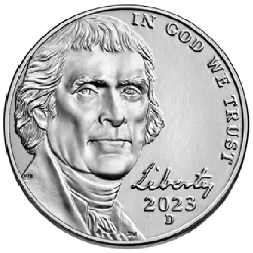 | 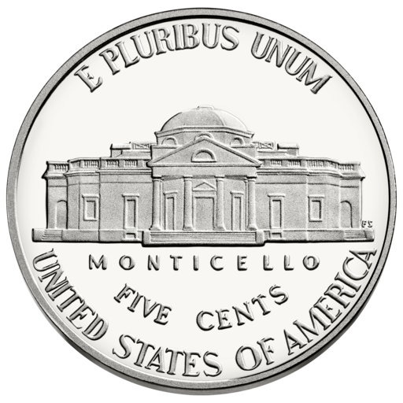 |
| $0.10 (Dime) | `ultimatebankingsystem:dime_coin` | 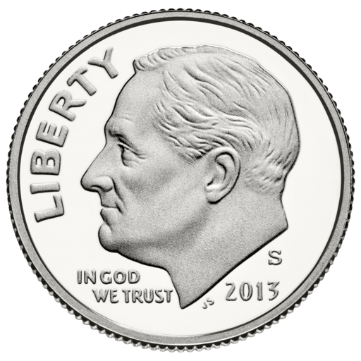 | 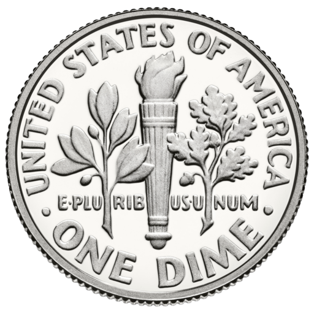 |
| $0.25 (Quarter) | `ultimatebankingsystem:quarter_coin` | 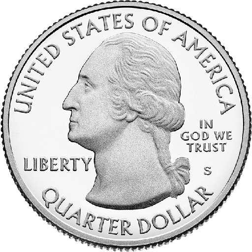 | 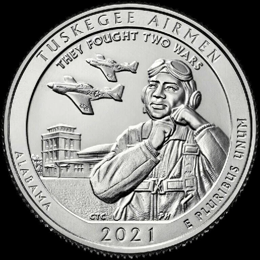 |
| $0.50 (Half Dollar) | `ultimatebankingsystem:half_dollar_coin` | 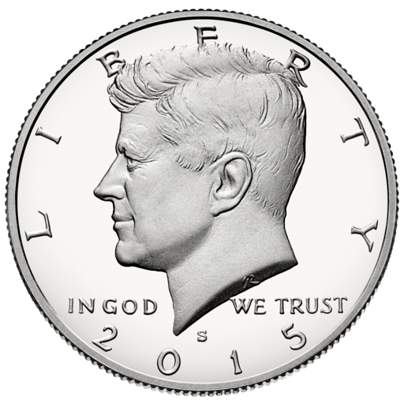 | 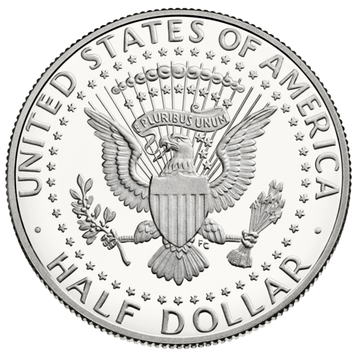 |
