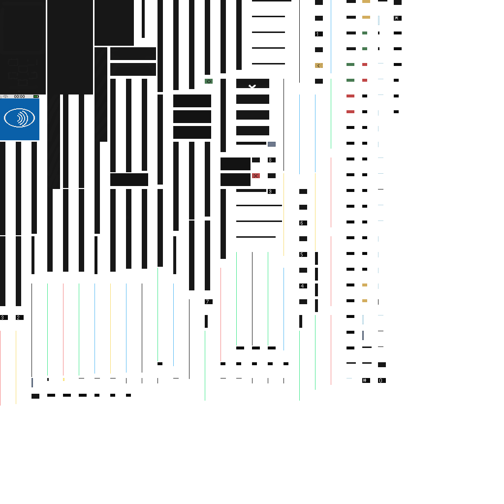
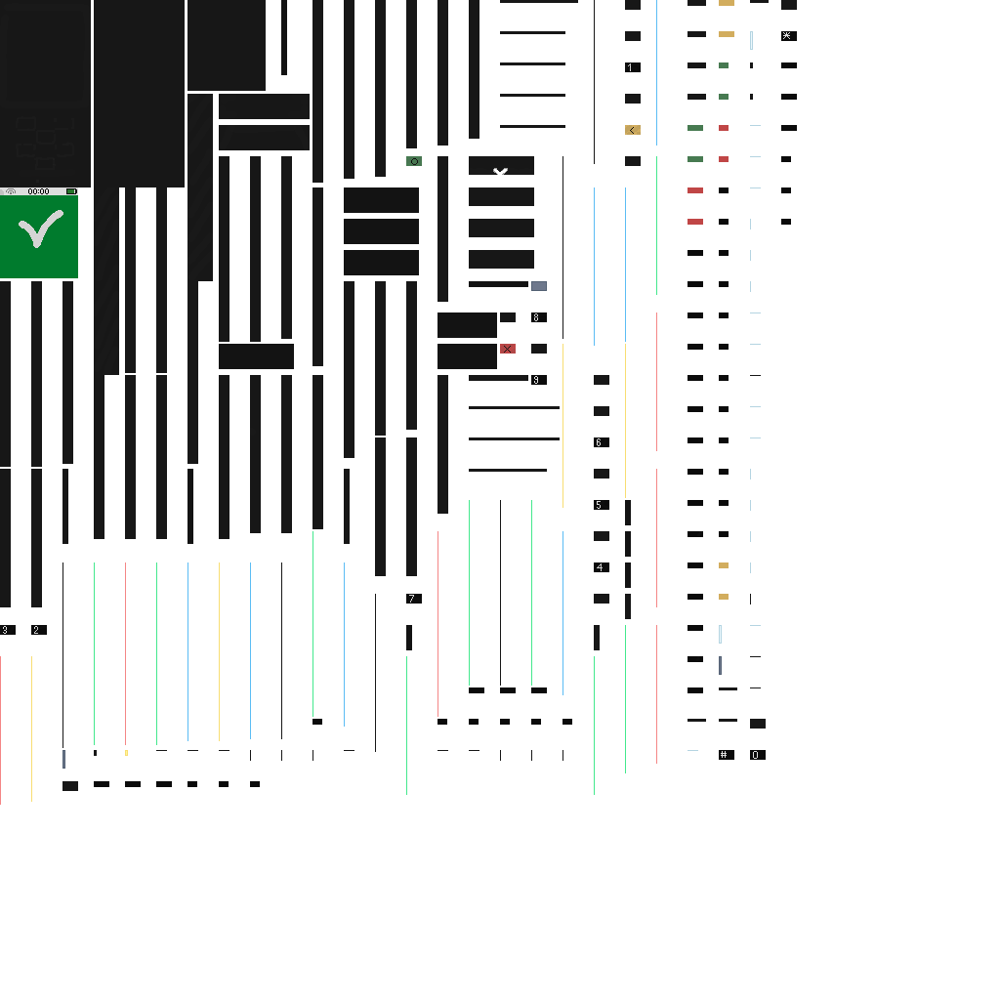
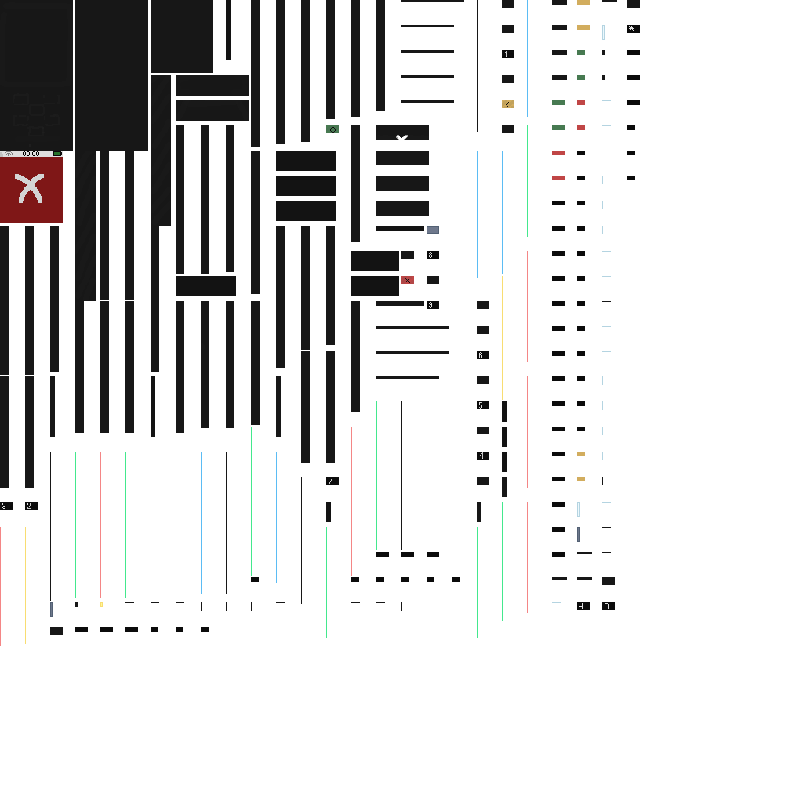

# Payment Terminal Guide

UBS supports two payment terminal formats:

- `payment_terminal` block (placed in world)
- `handheld_payment_terminal` item (portable player-to-player charging)

## Block

- Block ID: `ultimatebankingsystem:payment_terminal`
- Item model ID: `ultimatebankingsystem:payment_terminal`

Visual states:

- Idle: 
- Success: 
- Denied: 

## Placement and Interaction

- Terminal rotates to face the placer on placement (90° steps).
- Normal right-click: attempt payment.
- Shift + right-click: open terminal configuration UI.
- Only owner or OP (permission level 3) can configure.

## Handheld Terminal

- Item ID: `ultimatebankingsystem:handheld_payment_terminal`
- While holding handheld and aiming at a player, an on-screen info panel shows:
  - terminal name
  - configured amount
  - target player
  - interaction hint
- Right-click player: attempts payment against that target player.
- Shift + right-click (air or player): opens handheld configuration UI.
- Handheld supports idle/success/denied visual states in-hand.
- Handheld has no redstone outputs.

## Payment Source Rules

When a player pays at terminal:

- If the player is holding a valid UBS credit card, terminal uses the card-linked account.
- Otherwise terminal uses the player primary account.
- If no primary account exists and no valid card is held, payment is denied.

## Merchant Destination Rules

- Terminal must have a merchant account configured.
- Merchant and payer may be the same account (self-buy is allowed).
- Price is configured in whole dollars.

## Configuration UI

Open with Shift + right-click.

Configurable fields:

- Shop name
- Price (whole-dollar amount)
- Merchant account selector
- Success Pulse toggle
- Failure Pulse toggle
- Idle Pulse toggle
- Success signal strength (`1..15`)
- Failure signal strength (`1..15`)
- Idle signal strength (`1..15`)

Save writes config to the block entity.

### Handheld Config UI

Open with Shift + right-click while holding handheld terminal.

Configurable fields:

- Terminal name
- Price (whole-dollar amount)
- Merchant account selector

Save writes config directly to the handheld item.

Validation notes:

- Handheld price accepts whole dollars up to and including the configured max.
- Default max is `50000` and is controlled by `GlobalMaxSingleTransaction`.
- Values above the configured max are rejected on save with an explicit max-limit error.

## Redstone Behavior

- Terminal outputs comparator-style power from block `POWER_LEVEL` (`0..15`).
- Success/failure use configured strength while feedback state is active.
- Idle output stays continuously active at idle strength if Idle Pulse is enabled.

## Feedback / Lock Window

- After payment result, terminal enters a short busy window (currently 2 seconds).
- During this window, interaction is blocked for everyone.
- Result texture state is shown globally to all players (`success` or `denied`).
- The same success/denied feedback window is applied to handheld terminals in-hand.

## Commands Related to Terminal Payments

Alternative command flow:

- `/account shop pay <amount> [shop]`

Notes:

- Uses held valid credit card account when a card is in hand.
- Otherwise falls back to primary account.
- If `[shop]` parses as UUID, UBS treats it as merchant account ID.

## Troubleshooting

### "Terminal is busy"

Wait for the result window to clear, then interact again.

### "This terminal is not configured"

Set a merchant account in terminal config UI and save.

### "Set a primary account first"

Set a primary account, or hold a valid credit card linked to one of your accounts.

### "Payment failed: ..."

Common causes:

- insufficient funds
- expired/blocked/invalid credit card
- missing merchant account
- invalid terminal price
- configured max exceeded (handheld save validation)
